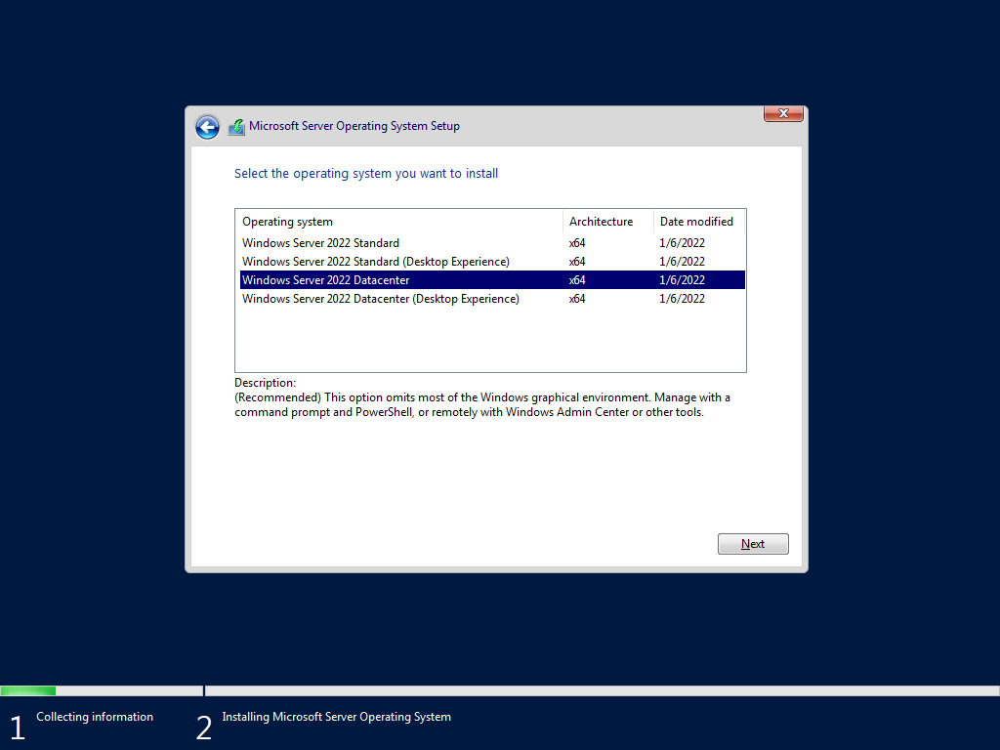
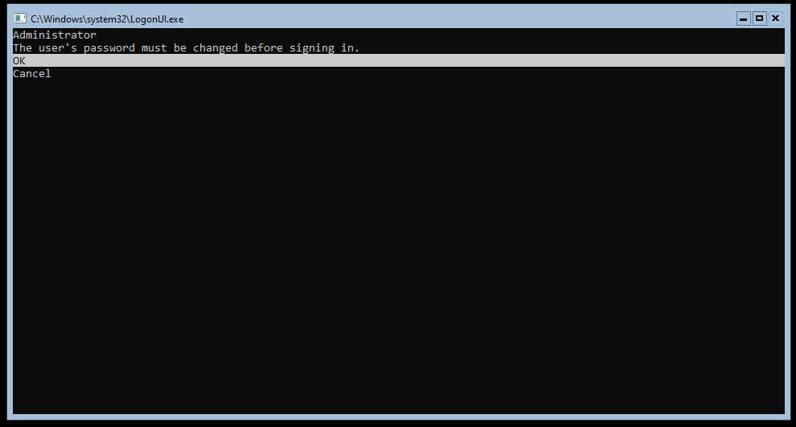
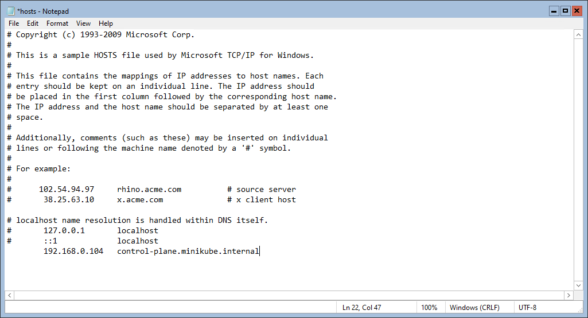

# Windows Containers on MiniKube

Currently, Windows containers are not supported on MiniKube. This repo describes the steps for a prototype of running Windows containers on MiniKube.


> Important: This is not a supported project by MiniKube. If the maintainers of MiniKube decide to support Windows containers, there's additional development work needed.

## What this project does
The goal of this project is to implement a Windows node to a MiniKube cluster, with the intent to try out Windows containers. What the steps in this projec will do, is to use the existing Kubernetes mechanism to add a Windows node to your MiniKube cluster, configure the Flannel CNI so the Windows and Linux can co-exist and comminicate with each other, to then allow you to deploy Windows containers to the Windows nodes. After completion, your MiniKube API won't be aware of the new Windows node, but the underlying Kubernetes infrastructure will. As a result, you can use kubectl, but not the minikube cli.


## Requirements
To get started you'll need:
- Windows 11 or 10 host with Hyper-V installed.
  - Check out the documentation on how to install [Hyper-V on Windows](https://docs.microsoft.com/virtualization/hyper-v-on-windows/quick-start/enable-hyper-v).
- An External Switch must be configured
  - Check out the documentation on how to create a new [Hyper-V Switch](https://docs.microsoft.com/virtualization/hyper-v-on-windows/quick-start/connect-to-network).
- MiniKube for Windows must be installed
  - Check out the documentaiton on how to install [MiniKube on Windows](https://minikube.sigs.k8s.io/docs/start/)
- An Evaluation install media (ISO file) for Windows Server 2022
  - You can download an evaluarion media for Windows Server 2022 [here](https://info.microsoft.com/ww-landing-windows-server-2022.html).

### Creating and configuring a new MiniKube cluster

Open a new elavated PowerShell session. Let's start by creating a new MiniKube cluster:

```powershell
$SwitchName = Read-Host -Prompt "Please provide the name of the External Virtual Switch to be used"
minikube start --driver=hyperv --hyperv-virtual-switch=$SwitchName --nodes=2 --cni=flannel --container-runtime=containerd
```

> Important: The above will deploy a 2 node cluster. You can change to a single node by removing '--nodes=2'. If deploy a single node, the command below needs to be run on just that node.

Next, we need to prepare the Linux nodes for Windows-specicif Flannel CNI configuration:

```powershell
minikube ssh
sudo sysctl net.bridge.bridge-nf-call-iptables=1
exit
minikube ssh -n minikube-m02
sudo sysctl net.bridge.bridge-nf-call-iptables=1
exit
```
Next, we will update the Flannel CNI for Windows. For this project, I have configured the kube-flannel.yml file with the appropriate settings:

```powershell
wget -Uri https://raw.githubusercontent.com/vrapolinario/MinikubeWindowsContainers/main/kube-flannel.yml -OutFile .\kube-flannel.yml
kubectl apply -f kube-flannel.yml
```

Now we need to make sure the flannel deamon set is restarted to reflect the new Windows-specific configuration.

```powershell
kubectl get ds -A
kubectl rollout restart ds kube-flannel-ds-amd64 -n kube-system
kubectl get pods -A
```

Make sure the pod has terminated and the new one is running. All pods should show a running state at this point.

### Creating a Windows node manually
For Linux nodes, you don't need to manually deploy the VM and OS, because MiniKube takes care of creating a new VM, downloading the OS image, and deploying the image to the VM. For Windows this is not supported, so we will perform these steps manually.

Let's start by creating a new VM:

```powershell
$VMName = 'minikube-m03'
$SwitchName = Read-Host -Prompt "Please provide the name of the External Virtual Switch to be used (This should be the same Switch as the MiniKube VMs"
$ISOFile = Read-Host -Prompt "Please provide the full path for the Windows Server 2022 install media (ISO file)"
New-VM -Name $VMName -Generation 1 -MemoryStartupBytes 6000MB -Path ${env:homepath}\.minikube\machines\ -NewVHDPath ${env:homepath}\.minikube\machines\$VMName\VHD.vhdx -NewVHDSizeBytes 127000MB -SwitchName $SwitchName
Set-VM -Name $VMName -ProcessorCount 2 -AutomaticCheckpointsEnabled $false
Set-VMProcessor -VMName $VMName -ExposeVirtualizationExtensions $true
Set-VMDvdDrive -VMName $VMName -Path $ISOFile
Start-VM -Name $VMName
```

You will need to install Windows Server 2022 on the VM. Follow the installation wizard to Install a Server Core instance:


After the installation is complete, you need to set up a new local admin password:


Once you're logged in, type 15 to exit the SCOnfig screen.

### Configuring the Windows node for MiniKube

> Important: The commands in this section need to be run inside the Windows node.

With the VM created and OS installed, we can now move to configuring the Windows node for MiniKube. Let's start by changing the instance name and installing the Continers feature:

```powershell
Set-SConfig -AutoLaunch $false
Rename-Computer -NewName minikube-m03
Install-WindowsFeature -Name containers
Restart-Computer -Force
```

> Important: You can use a different name for this Windows instance. I'm keeping "minikube-m03" for consistency with the other nodes.

Now let's download ContainerD:
```powershell
$Version="1.6.6"
curl.exe -L https://github.com/containerd/containerd/releases/download/v$Version/containerd-$Version-windows-amd64.tar.gz -o containerd-windows-amd64.tar.gz
tar.exe xvf .\containerd-windows-amd64.tar.gz
```

After downloading, let's configure ContainerD for Windows:
```powershell
Copy-Item -Path ".\bin\" -Destination "$Env:ProgramFiles\containerd" -Recurse -Force
cd $Env:ProgramFiles\containerd\
.\containerd.exe config default | Out-File config.toml -Encoding ascii
notepad config.toml
```

The command above will copy the ContainerD binaries to the Program Files folder, and create a new config file. After that, Notepad will open so you can change some settings. You need to change the folling parameters:

|Setting|Old value|New Value|
|-------------|----------------|----------------|
|bin_dir|"C:\\\Program Files\\\containerd\\\cni\\\bin"|"c:\\\opt\\\cni\\\bin"|
|conf_dir|"C:\\\Program Files\\\containerd\\\cni\\\conf"|"c:\\\etc\\\cni\\\net.d\\\\"|

Save the file and close Notepad. Now let's create the folders above and register (and start) the ContainerD service:

```powershell
mkdir c:\opt\cni\bin
mkdir c:\etc\cni\net.d
.\containerd.exe --register-service
Start-Service containerd
get-service containerd
```

The output of the command above should show the ContainerD service as Running.
Now, let's install NSSM:
```powershell
mkdir c:\k
$arch = "win64"
curl.exe -L https://k8stestinfrabinaries.blob.core.windows.net/nssm-mirror/nssm-2.24.zip -o nssm.zip
tar.exe C c:\k\ -xvf .\nssm.zip --strip-components 2 */$arch/*.exe
```

Now, let's install kubelet:
```powershell
$KubernetesVersion="v1.23.3"
curl.exe -L https://dl.k8s.io/$KubernetesVersion/bin/windows/amd64/kubelet.exe -o c:\k\kubelet.exe

@"
# Start file needed to support kubeadm extra args
`$FileContent = Get-Content -Path "/var/lib/kubelet/kubeadm-flags.env"
`$kubeAdmArgs = `$FileContent.TrimStart(`'KUBELET_KUBEADM_ARGS=`').Trim(`'"`')

`$args = "--cert-dir=`$env:SYSTEMDRIVE/var/lib/kubelet/pki",
        "--config=`$env:SYSTEMDRIVE/var/lib/kubelet/config.yaml",
        "--bootstrap-kubeconfig=`$env:SYSTEMDRIVE/etc/kubernetes/bootstrap-kubelet.conf",
        "--kubeconfig=`$env:SYSTEMDRIVE/etc/kubernetes/kubelet.conf",
        "--hostname-override=$(hostname)",
        "--enable-debugging-handlers",
        "--cgroups-per-qos=false",
        "--enforce-node-allocatable=``"``"",
        "--resolv-conf=``"``""

`$kubeletCommandLine = "c:\k\kubelet.exe " + (`$args -join " ") + " `$kubeAdmArgs"
Invoke-Expression `$kubeletCommandLine
"@ | Set-Content -Path c:\k\Start-kubelet.ps1

c:\k\nssm.exe install kubelet Powershell -ExecutionPolicy Bypass -NoProfile c:\k\Start-kubelet.ps1
c:\k\nssm.exe set Kubelet AppStdout C:\k\kubelet.log
c:\k\nssm.exe set Kubelet AppStderr C:\k\kubelet.err.log
```

The command above will download and install kubelet for Windows. However, notice the kubelet service will not start until a further stage on which we join the Windows node to the MiniKube Kubernetes cluster using kubeadm.
Now we need to open the appropriate ports on Windows Firewall:
```powershell
New-NetFirewallRule -Name kubelet -DisplayName 'kubelet' -Enabled True -Direction Inbound -Protocol TCP -Action Allow -LocalPort 10250
```

The next step is a hack for the Windows node to be able to find the master Linux node via its FQDN:
```powershell
notepad C:\Windows\System32\drivers\etc\hosts
# Add the IP address and control-plane.minikube.internal to the Hosts file
```

You will need to append the IP address of the master node to the Hosts file on the Windows node.

> You can find the IP address of the master Linux node by running the following command on your machine:
>```powershell
>minikube node list
>```

Your hosts file should look similar to this:


Save the file and close Notepad.
Now, let's download kubeadm:
```powershell
curl.exe -L https://dl.k8s.io/$KubernetesVersion/bin/windows/amd64/kubeadm.exe -o c:\k\kubeadm.exe
cd c:\k
```

At this point, your Windows node is essentially ready to join the MiniKube Kubernetes cluster. However, you will need the join command from the Linux nodes to proceed.

### Get the Join command for kubeadm
To get the join command for kubeadm, run the following on your machine:

```powershell
minikube ssh
cd /var/lib/minikube/binaries/v1.23.3/
sudo ./kubeadm token create --print-join-command
```

Copy the output for the join command. You will need to append --cri-socket "npipe:////./pipe/containerd-containerd" to the command. On the Windows node, run the command provided on the previous step with the above setting for ContainerD. Your command will look like this:
```powershell
.\kubeadm.exe join control-plane.minikube.internal:8443 --token c3k6qb.zn7kjtq7l74m0zcz --discovery-token-ca-cert-hash sha256:8ceaf34a09e0e5cf4f82d523d3c9068e78d390b221d606dc6f1224400b164f6c --cri-socket "npipe:////./pipe/containerd-containerd"
```

> Important: An error at this stage is expected. MiniKube expects to find some files in a different folder than kubelet, so we need to fix that before the command succeed. Do not stop the command until it finishes.

After getting the error from kubelet, run the following to fix it:
```powershell
mkdir c:\var\lib\minikube\certs
Copy-Item C:\etc\kubernetes\pki\ca.crt -Destination C:\var\lib\Minikube\Certs
Remove-Item C:\etc\kubernetes\pki\ca.crt
```

Now run the kubeadm join command again. This time, the command should succeed.

### Validating node join
To ensure your Windows node has properly joined the cluster, you can run the following on your machine:
```powershell
kubectl get nodes -o wide
```

The output of the command should show the Windows node along with the Linux nodes.
```powershell
PS C:\Users\viniap> kubectl get nodes -o wide
NAME           STATUS     ROLES                  AGE   VERSION   INTERNAL-IP     EXTERNAL-IP   OS-IMAGE                         KERNEL-VERSION   CONTAINER-RUNTIME
minikube       Ready      control-plane,master   88m   v1.23.3   192.168.0.104   <none>        Buildroot 2021.02.4              4.19.202         containerd://1.4.12
minikube-m02   Ready      <none>                 87m   v1.23.3   192.168.0.105   <none>        Buildroot 2021.02.4              4.19.202         containerd://1.4.12
minikube-m03   NotReady   <none>                 73s   v1.23.3   192.168.0.106   <none>        Windows Server 2022 Datacenter   10.0.20348.469   containerd://1.6.6
```
You will notice the status of the Windows node it "NotReady". This is because the networking for this node is not properly configured yet.

### Configure Flannel and Kube-Proxy on the Windows node
Now that the Windows node has joined the cluster, we can configure the networking settings as any Kubernetes cluster, by using kubectl. To get started, let's apply the Flannel Overlay configuration by leveraging the official tools from SIG-Windows:

```powershell
kubectl apply -f https://raw.githubusercontent.com/kubernetes-sigs/sig-windows-tools/master/hostprocess/flannel/flanneld/flannel-overlay.yml
```

Now we need to configure kube-proxy. For the purpose of this project, I have configured the YAML file:
```powershell
wget https://raw.githubusercontent.com/vrapolinario/MinikubeWindowsContainers/main/kube-proxy.yml -OutFile .\kube-proxy.yml
kubectl apply -f .\kube-proxy.yml
```

The commands above will result in two new pods being created under the kube-system namespace. You can check the progress of the deployment by running:
```powershell
kubectl get pods -A
```

You can now check the status of your Windows node by running the kubectl get nodes -o wide command again as above. The output now should show the Windows node as Ready:
```powershell
PS C:\GitHub\MiniKube Windows Containers> kubectl get nodes -o wide
NAME           STATUS   ROLES                  AGE    VERSION   INTERNAL-IP     EXTERNAL-IP   OS-IMAGE                         KERNEL-VERSION   CONTAINER-RUNTIME
minikube       Ready    control-plane,master   100m   v1.23.3   192.168.0.104   <none>        Buildroot 2021.02.4              4.19.202         containerd://1.4.12
minikube-m02   Ready    <none>                 99m    v1.23.3   192.168.0.105   <none>        Buildroot 2021.02.4              4.19.202         containerd://1.4.12
minikube-m03   Ready    <none>                 13m    v1.23.3   192.168.0.106   <none>        Windows Server 2022 Datacenter   10.0.20348.469   containerd://1.6.6
```

Congrats! Now your MiniKube Kubernetes cluster is ready receive a Windows container application.

## Get a Windows container up and running
Given the limitation explained in the next section, the example here simply brings up a new container with no exposed ports. The intent is to simply prove that a Windows container is running.

To get a Server Core container running on your environment, you can run:

```powershell
wget https://raw.githubusercontent.com/vrapolinario/MinikubeWindowsContainers/main/IIS-Sample.yaml -OutFile .\IIS-Sample.yaml
kubectl apply -f .\IIS-Sample.yaml
```

It will take a while for the image to download. You can check the status of the container by running:

```powershell
kubectl get pods
```

Once the container is in a "Running" state, you can interact with it:

```powershell
kubectl exec <pod-name> -- powershell dir
```
The above will execute the "dir" command inside the container and return the output.

## Known issues

As of July-6, the following are known issues:

- While Windows containers will run fine in this prototype, there's a known networking issue. MiniKube exposes NodePort or LoadBalancer in a different way than regular Kubernetes. Since this prototype (as of this date) does not inform MiniKube of the new node, MiniKubeis unable to expose ports (and consequently the service) for the Windows node. There's currently an issue open and an ask for help to get this working on [GitHub](https://github.com/kubernetes/minikube/issues/2015#issuecomment-1175677726).
- You mught see a "CrashLoopBackError" for the kube-proxy pod after applying the final configurations before it shows the status "Running". Since this pod uses host process containers to configure the host, waiting a few retries should work and the pod should show "Running" after a few attempts.
- If you try to run a Windows container and it fails, you might need to update the Windows node. Open the VM and log in. Type "sconfig" on PowerShell and select option #6 to start Windows update.

## Clean up
To clean up your environment, you can run the following:

```powershell
#Delete MiniKube cluster
minikube delete --all
#Remove VM
$VMName = 'minikube-m03'
Stop-VM -Name $VMName -TurnOff
Remove-VM -Name $VMName -Force
Remove-Item -Path ${env:homepath}\.minikube\machines\$VMName -Force -Recurse
```